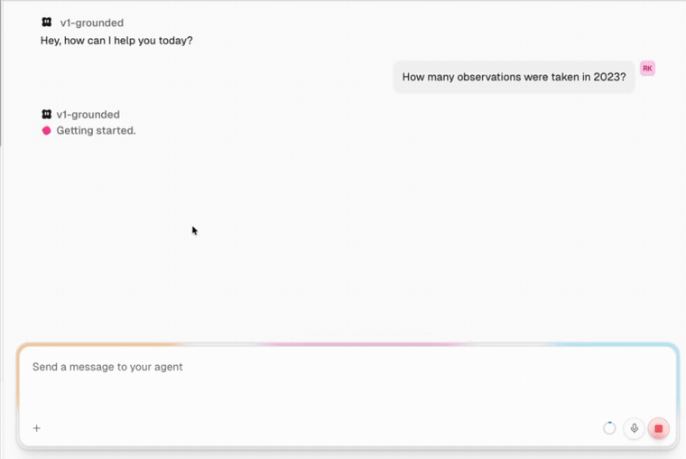
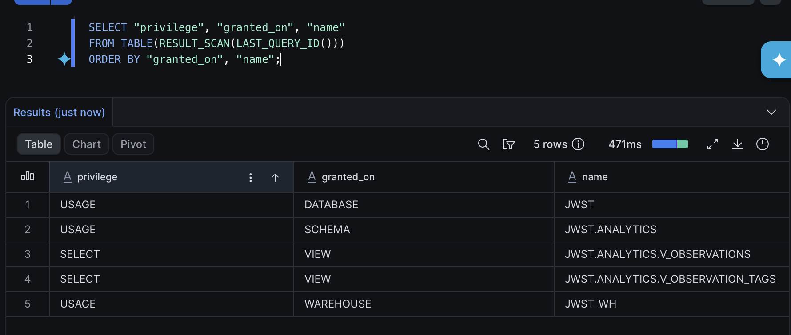
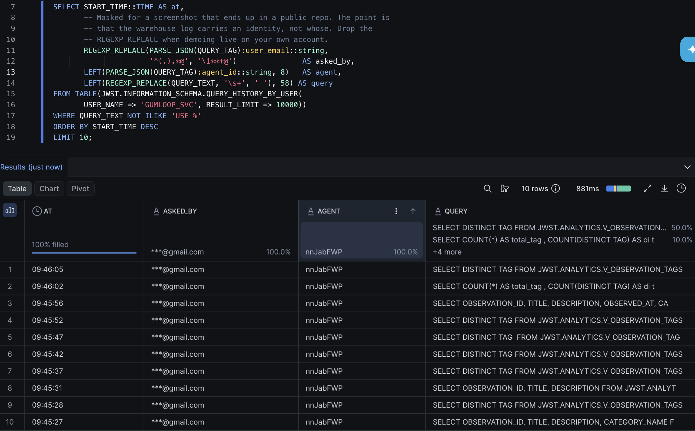
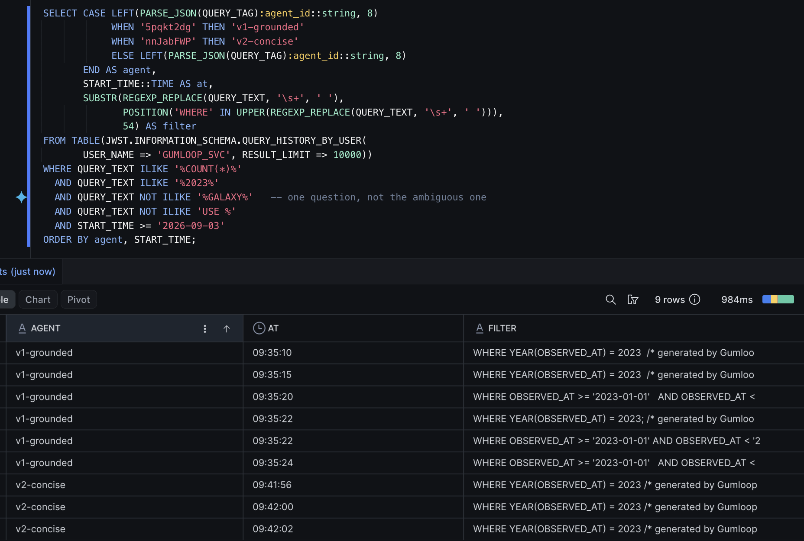

# JWST × Gumloop: letting non-engineers query the warehouse, safely

Every company has a warehouse and a queue of people who need answers out of it.
The person who knows which question matters usually can't write the SQL, so they
file a ticket, wait two days, and the data team becomes a bottleneck for
questions that take ninety seconds to answer.

Letting them ask in plain English is the obvious fix, and every BI vendor sells
a version of it. Those pilots die for two reasons, and neither is the model: IT
can't scope what the thing sees, and nobody can tell when it quietly breaks.

This is both answers, built on Gumloop over a Snowflake warehouse of 979 James
Webb Space Telescope observations. Every number below came out of a real run.



## The situation

An ops lead has an agent that queries the warehouse. Two weeks in, they decide
it's too slow and too wordy, open the prompt, and edit it:

> *Minimise queries. Do not re-run a query to double-check a number you already
> have. If a sample of rows already shows you the answer, use it rather than
> running another aggregate.*

Every line is defensible. Nobody would block it in review. So: better or worse?

I wrote two prompts differing only in that rules block, and ran 14 questions
three times against each. The questions are generated from the warehouse, so an
expected answer can't drift from the data.

## What I found

```
  overall                        baseline candidate  change
    ok    answer_accuracy           90.5%     95.2%    +4.8   n=42
    ok    aggregate_discipline     100.0%    100.0%    +0.0   n=39
    ok    query_efficiency          50.0%    100.0%   +50.0   n=39

  All gates passed.
```

**The edit was a good change** — half the queries, no loss of accuracy.

Which is not what I built this expecting. The concise prompt was written to push
the agent into counting a `LIMIT 100` sample instead of asking SQL to count, and
Sonnet 4.6 never took the bait: `aggregate_discipline` is 100% on both sides
across all 78 applicable answers. I went looking for a regression and the data
said no. A check you only trust when it fails isn't a check.

The six wrong answers were more interesting than the regression I wanted.

**Verifying confirmed the arithmetic and missed the misreading.** Five came from
one ambiguous question of mine. The grounded agent ran its filter, ran it a
second way, got the same number, and reported *"Both queries agree"* — which
made a wrong answer sound more trustworthy than an unverified one. Re-running
your own query validates your arithmetic, not your reading of the question.

**The careful agent produced the dangerous answer.** The sixth was a grounded run
on the restricted question concluding *"there are no observations under embargo
in this dataset."* There are twenty-five; it can't see them. Told to be
thorough, it searched everything, found nothing, and turned that into a fact
about data behind a security boundary. The concise agent reported the limit
cleanly three times out of three — **66.7% against 100%** on that question.

## What it can see

Bounded in the warehouse, not the prompt, because a prompt is a suggestion.



The role holds `SELECT` and nothing else, granted on views rather than tables —
a prompt injection has no write privilege to exercise, and widening access is a
diff in [`sql/01_schema.sql`](sql/01_schema.sql). `OBSERVATION_EMBARGO` is never
granted, so the agent doesn't hit a permission error; it can't see the table
exists.

The agent has its own service identity: key-pair auth, one role, no password,
secondary roles disabled. Gumloop's connector has no role field, so a connection
runs as the user's `DEFAULT_ROLE` — point it at a human account and the agent
silently inherits `ACCOUNTADMIN`. `Stage Data` is disabled on the agent too, so
read-only holds at the platform *and* the warehouse.

Every query lands in `QUERY_HISTORY` tagged with the user, the agent version and
the conversation, so a query traces back to whoever asked — in the tool the data
team already has.



## What happens when someone changes it

Same person, same question, two agent versions, in Snowflake's own log:



The grounded agent counts, then asks the same question a second way. The concise
one counts once. That's the trade, visible without the eval harness — and it's
how you'd monitor this in production: group `QUERY_HISTORY` by agent and watch
the SQL shape change.

All three checks are exact; none calls a model. A judge asked whether "roughly
90" matches "92" will sometimes say yes, and for a data agent that's the whole
failure mode. Gumloop's own Evaluations grade transcripts against yes/no
criteria on live traffic, which suits judgement about prose — but they grade one
conversation at a time, and *"is this worse than production"* is a question
about two populations. That's what [`evals/gate.ts`](evals/gate.ts) adds.

| Check | What it verifies | v1 | v2 |
|---|---|---|---|
| `answer_accuracy` | the figure matches the warehouse | 90.5% | 95.2% |
| `aggregate_discipline` | SQL did the counting, not the agent | 100% | 100% |
| `query_efficiency` | queries against the optimum | 50.0% | 100% |

Limits live in [one small file](evals/thresholds.json). `query_efficiency` has
no floor on purpose: it rewards running fewer queries, so a floor would push
toward exactly what the other two exist to prevent.

## Running it

Node 24+, a Snowflake trial ($400 / 30 days, no card) and a Gumloop Pro trial. A
full comparison costs about 4,000 of the 20,000 credits.

```bash
npm install && npm test     # 29 unit tests, no accounts needed
npm run fixtures            # see the gate work, no credits spent
npm run gate -- --baseline demo-baseline --candidate demo-candidate
```

[`docs/SETUP.md`](docs/SETUP.md) is the full build, about 30 minutes.
[`docs/DEMO.md`](docs/DEMO.md) is a 15-minute walkthrough.

```
prompts.md   the two prompts — the only difference between the runs
sql/         schema, grants and the service identity
evals/       3 checks, 14 questions, and the gate
data/        generates the SQL and the questions from one corpus file
runs/        the 84 interactions behind every number above
```

## Caveats

*"How many 'galaxy' observations were taken in 2023?"* is ambiguous, and five of
the six wrong answers are it. `data/verify_sql.py` can't catch that
structurally — it checks an answer against SQL, not that a question has one
reading. Left in place because the finding depends on it.

Categories come from matching Flickr tags against a rule list rather than
hand-labelling, so they're rough. Fourteen questions is demo scale; at real
scale they'd come from what people already send the data team, and the checks
would run against sampled production traffic, not only CI. What carries over is
the mechanism: bound what the agent reaches in the warehouse, and measure a
change before it ships.

Same corpus and the same argument on Braintrust, where the agent is a
tool-calling loop rather than a warehouse client:
[JWST-braintrust](https://github.com/RK-A1/JWST-braintrust).
